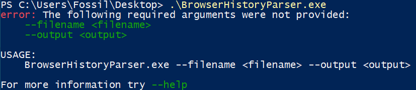
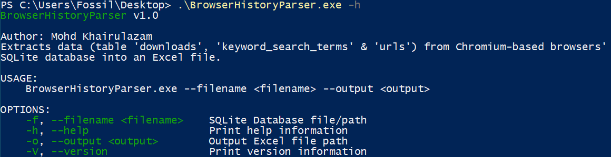
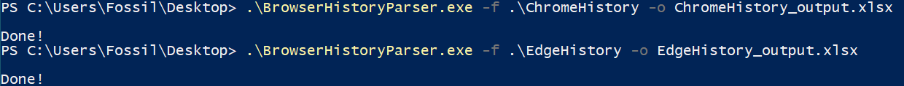

# BrowserHistoryParser
Extracts data (table 'downloads', 'keyword_search_terms' & 'urls') from Chromium-based browsers' SQLite database into an Excel file.

## Intro
A tool that extracts data from Chromium-based browsers. This tool will extract data from table "downloads", "keyword_search_terms" & "urls". All these info will be exported into Excel file (.xlsx).

So far, this tool has been tested on Chrome & Edge browser "History" artifacts.

## How to Run
- Copy “BrowserHistoryParser.exe” to your host machine
- Then run the script as below:
BrowserHistoryParser.exe  -f <filename> -o <outputfile>
e.g. BrowserHistoryParser.exe  -f ChromeHistory -o <outputfile> ChromeHistory_output.xlsx

## Screenshot
<kbd></kbd>

Figure 1 – BrowserHistoryParser with any parameter

<kbd></kbd>

Figure 2 – BrowserHistoryParser with -h (help) parameter

<kbd></kbd>

Figure 3 – BrowserHistoryParser processing Chrome and Edge History artifacts

### Example Outputs
<kbd></kbd>

Figure 4 – Example of parsed Chrome History artifacts

<kbd></kbd>

Figure 5 – Example of parsed Chrome History artifact (notice the 3 separated sheet below; representing table extracted from artifact)

## Changelogs
- 1.0  (21 Feb 2024): First version of the tool.
